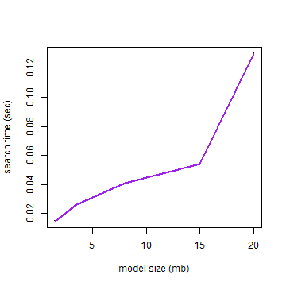

## What about it

Main subject of Capstone Project was text-mining and its application.
It was proposed to create a word-prediction application in order to
practice both:

 - theory behind building predictive models
 - practical implementation and demonstration of learned concepts

Learning dataset to train the model was provided as well and consisted
of records, collected from Twitter, blogs and news articles.

It was proposed to use R programming environment and its frameworks
to clean-out provided data, train the model and build on-line text-prediction
application.

--- .class #id

## Basic work description

What is meant under term 'word prediction' : given the sequence of K words,
model must predict what K+1'st word would be.

Rationale behind this task is :
- consider English language as an example
- on an average, the phrase 'big green frog' is much more likely to occur then
the phrase 'big green fox'
- vice versa - the phrase 'big red fox' is much more likely then the phrase
'big red frog'
- given big enough language corpus, one can calculate likeliness of each
combination of words (length of the combination can be selected arbitrary)

These 'combinations' are usually referred to as 'N=grams', where N - number of
words in a combination. If we take big enough training data, such that it is a
good representative of chosen language, we can calculate 'weights' for all N-grams.
The more often an N-gram is met - the bigger is its weight.

--- .class #id

## Some details

To accomplish this task, a very simple combination of 2-gram and 3-gram models
was used. Models were build by:
- cleaning out training data from numbers, punctuation, grammar stop-words, profanity
- building 2- and 3-grams over resulting text
- removing N-grams that occur very seldom (this is a tunable parameter of a model)

After the model is built, prediction works as follows:
- pre-process input text the same way as training data was pre-processed
- predict next word using 3-gram model (only 2 last words of phrase are used)
- predict next word using 2-gram model (only last word of phrase is used)
- 3-gram prediction has more weight, use it as main result. In case 3-gram model
makes empty prediction - use 2-gram prediction

Several likely candidates are considered, but candidate with the highest frequency
is taken as the most likely answer.

--- .class #id

## Complexity-Interactivity Trade-off

One issue with such simple model - its size. It grows exponentially with the size
of training data. And with growth of model, prediction time grows exponentially.

This factor makes size of model and speed of a search very important issues for
an interactive application.

--- .class #id

## Results and demonstration

To get adequate prediction accuracy and model size, a model with 150k 2-grams
and 400k 3-grams was finally selected.

To see the demonstration of the application, use the link:
https://pglushkov.shinyapps.io/capstone_project/

To see the code, used to build model, app and slides, use the link:
https://github.com/pglushkov/DataScienceCapstone_project

Thank you for your time! ;-)
